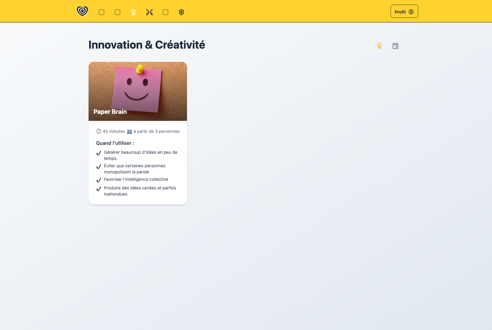
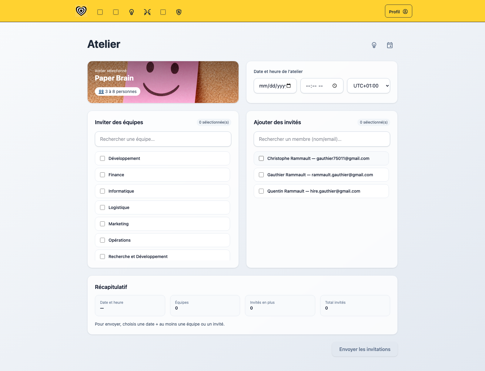
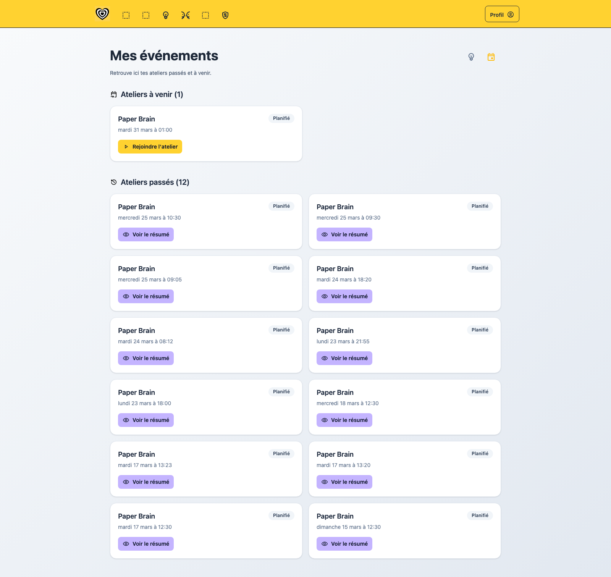
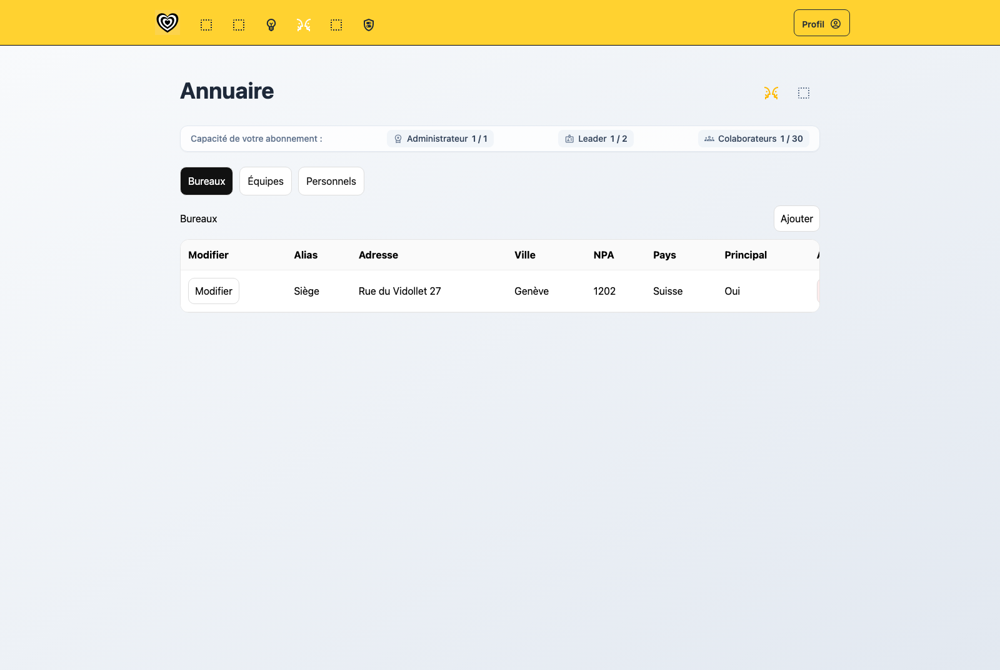
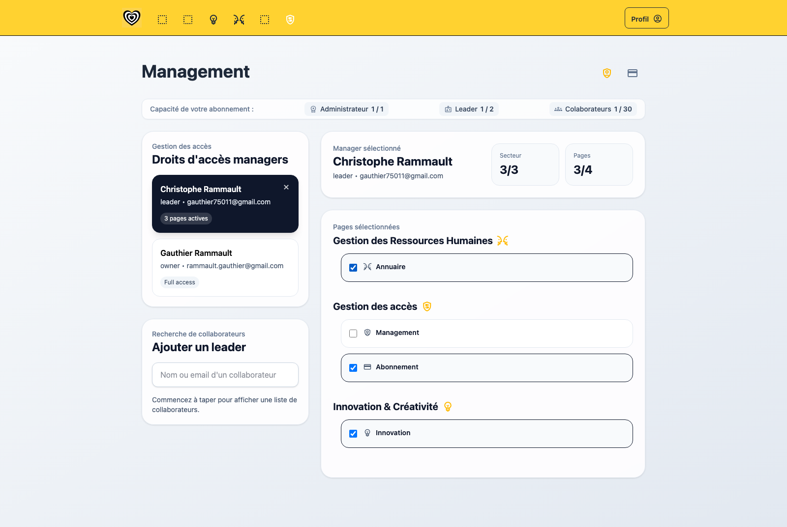
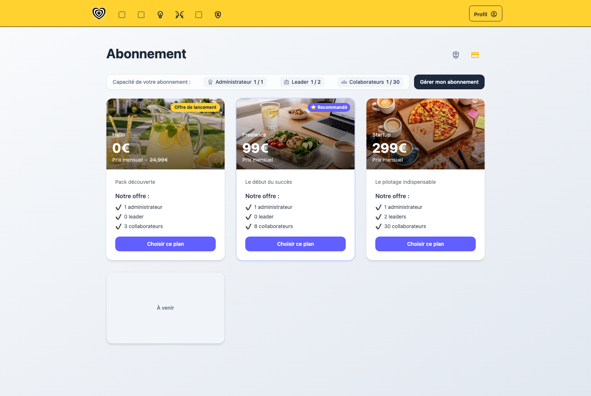
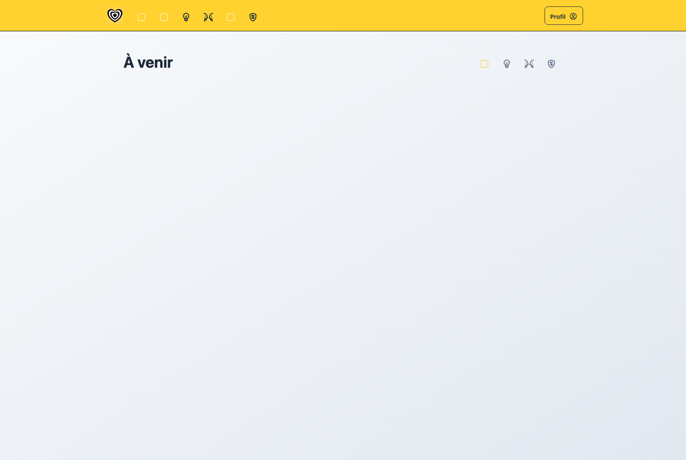

# Data-Driven Management System

This App is hosted on Firebase and is accessible at the following address:
- [zzzbre.com](https://zzzbre.com)

## Description

This project represents the first building block of a **SaaS (Software as a Service)** solution dedicated to data-driven strategic management for companies, designed for executives and C-level leaders (C-suite).

This initial version includes a module entitled **“Innovation & Creativity”**, designed as a suite of collaborative tools aimed at structuring and facilitating innovation processes based on recognized methodologies.


## Table of Contents

- [Data-Driven Management System](#data-driven-management-system)
  - [Description](#description)
  - [Table of Contents](#table-of-contents)
  - [Objective](#objective)
  - [Target Audience](#target-audience)
  - [Current Modules](#current-modules)
  - [Repository Structure](#repository-structure)
  - [Installation](#installation)
  - [Available Scripts](#available-scripts)
  - [Page Screenshots](#page-screenshots)
    - [Auth](#auth)
    - [Innovation](#innovation)
    - [Team](#team)
    - [Management](#management)
    - [Soon](#soon)
  - [Security](#security)
  - [Changelog](#changelog)
  - [Contributing](#contributing)
  - [License](#license)
  - [Author](#author)

## Objective

Provide a practical SaaS foundation for strategic, data-driven management workflows used by leadership teams and managers.

## Target Audience

- C-level leaders and decision makers
- Innovation managers and workshop facilitators
- HR and operations teams managing organization structure and access

## Current Modules

- `Auth`: sign-in, company registration, and password reset
- `Innovation`: workshop catalog, invitation workflow, and scheduled/past sessions
- `Team`: company directory management (offices, departments, members)
- `Management`: manager access controls and subscription management

## Repository Structure

```text
datadriven/
├── docs/
│   └── images/
│       ├── innovation/
│       ├── management/
│       └── team/
├── functions/
├── scripts/
│   └── capture-pages.mjs
├── src/
│   ├── components/
│   ├── constants/
│   ├── hooks/
│   ├── pages/
│   │   ├── auth/
│   │   ├── innovation/
│   │   └── management/
│   ├── workshops/
│   └── App.jsx
├── tests/
├── firebase.json
├── package.json
└── README.md
```

## Installation

Install dependencies:

```bash
npm install
```

Start the development server:

```bash
npm run dev
```

## Available Scripts

```bash
npm run dev          # Start Vite in development mode
npm run build        # Build production assets
npm run preview      # Preview the production build locally
npm run test         # Run unit/integration tests with Vitest
npm run lint         # Run ESLint
npm run doc          # Generate JSDoc documentation
npm run screenshots  # Capture route screenshots into docs/images
```

## Page Screenshots

### Auth

- `/login`  
  
- `/register`  
  
- `/reset-password`  
  

### Innovation

- `/innovation/ateliers`  
  
- `/innovation/invitation`  
  
- `/innovation/scheduled`  
  

### Team

- `/team/annuaire`  
  

### Management

- `/management/comptes`  
  
- `/management/abonnement`  
  

### Soon

- `/soon`  
  

## Security

Security reporting process is documented in [SECURITY.md](SECURITY.md).

## Changelog

Project changes are tracked in [CHANGELOG.md](CHANGELOG.md).

## Contributing

Contributions are welcome. Start with [CONTRIBUTING.md](CONTRIBUTING.md) and [CODE_OF_CONDUCT.md](CODE_OF_CONDUCT.md).

## License

License details are available in [LICENSE.md](LICENSE.md).

## Author

Gauthier Rammault
